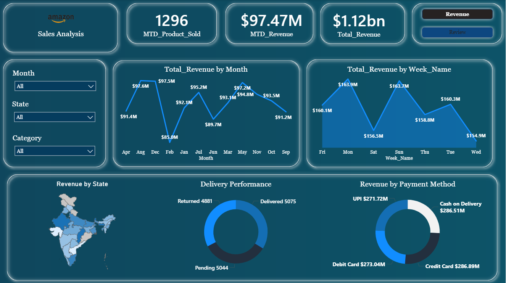
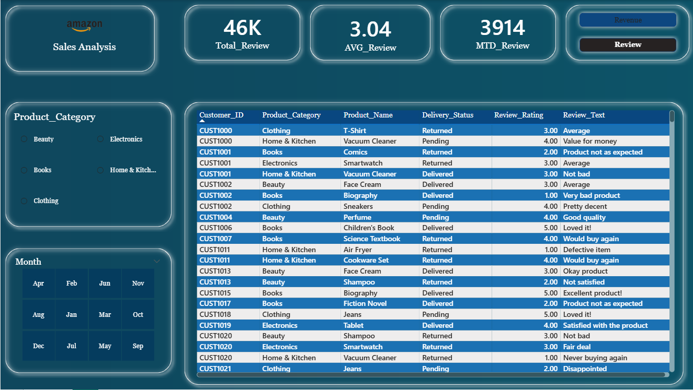

# Amazon-Sales-Analysis

This project presents a complete end-to-end analysis of Amazon’s annual sales to uncover customer behaviour, product performance, payment trends, and delivery efficiency.
Python is used for data cleaning, preparation, and exploratory analysis, while Power BI is used to design interactive dashboards for business storytelling.

## 🔍 Business Problem
E-commerce platforms experience high customer demand during major sales seasons.
However, understanding which product categories and items drive the highest revenue,
and how customer feedback and purchasing behaviour influence sales, remains crucial for
optimizing business strategy.

This project evaluates Amazon’s overall sales performance, identifies top-performing
categories & products, analyses customer sentiment, and uncovers key revenue patterns.

-- 

# 🛠️ Tech Stack & Skills
## Python
- Pandas, NumPy
- Matplotlib, Seaborn
- Data Cleaning & Preparation
- Exploratory Data Analysis (EDA)
- Business Insights

## Power BI
- Dashboard Design
- KPIs & Visual Storytelling
- Data Modeling
- Filters & Slicers
- Report Building

--   

# 📂 Project Workflow

### 1.Data Loading & Cleaning
### 2.Feature Engineering (Month, Week, Day)
### 3.EDA – Price, Quantity, Rating, Revenue Distributions
### 4.Correlation Analysis
### 5.Top Categories & Products Analysis
### 6.Customer Behaviour & Feedback Study
### 7.Sales Trend Analysis (Month, Week, Daily)
### 8. Payment Method Analysis
### 9. Delivery Performance Review
### 10.Power BI Dashboards (Revenue + Customer Review)  

-- 

# 📈 Key Insights 

- Amazon’s sales show strong performance across major categories like Beauty, Books, Electronics, Home & Kitchen, and Clothing.
- Revenue is primarily driven by premium-priced items and higher quantity orders.
- Customer feedback is largely positive, with high average ratings for beauty, books, and home products.
- Sales remain consistent throughout the year with spikes in festive months.
- All major payment methods — Credit Card, COD, Debit Card, UPI — contribute almost equally.
- Maharashtra, Karnataka, Tamil Nadu, Uttar Pradesh, and West Bengal lead in state-wise revenue.
- High pending/returned orders highlight areas for improvement in delivery & logistics efficiency.

  --

 # 📊 Dashboards
## 1️⃣ Revenue Dashboard

- Total Revenue, Orders, Delivered/Pending/Returned
- Top Products & Top States
- Monthly/Weekly Trends
  
## 2️⃣ Customer Review Dashboard

- Average Ratings
- Review Categories
- Review Sentiment Patterns

# 📎 Project Files

- 📘 Python EDA Notebook
- 📄 PDF Report
- 📂 Dataset
- 🖼️ Power BI Dashboard (Images + PBIX file)
- 📑 Business Problem Document
- 🎞️ PPT Presentation

-- 
# ⭐ Conclusion

This project demonstrates a complete end-to-end data analytics workflow—
from data cleaning and analysis using Python to interactive dashboard creation using Power BI.
It provides actionable business insights that can help improve sales strategy, product performance,
and customer experience.

--
# 🙌 Author

**Ravi Kumar Gupta**
📍 Delhi, India  

